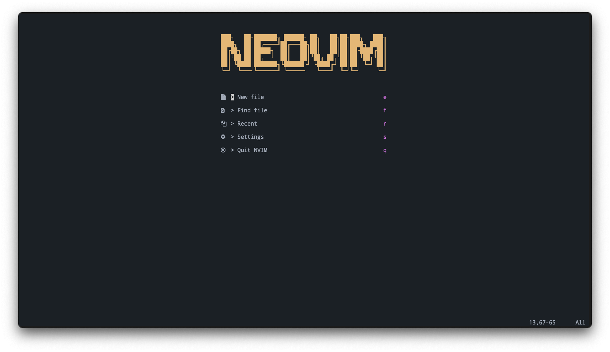
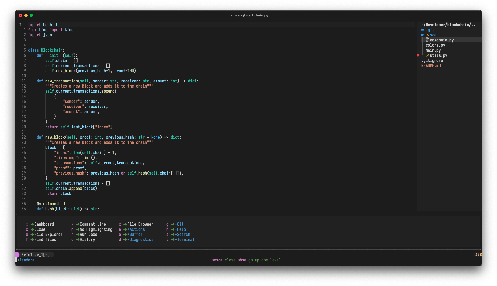
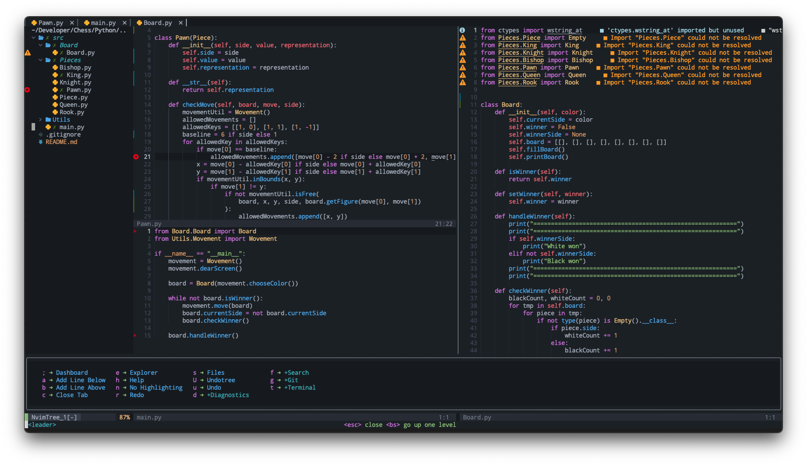
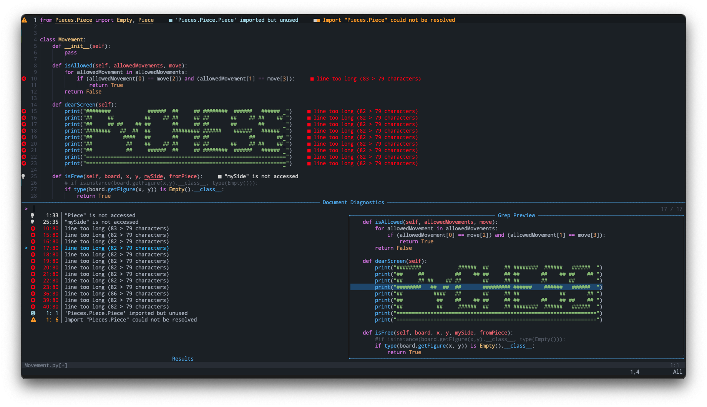
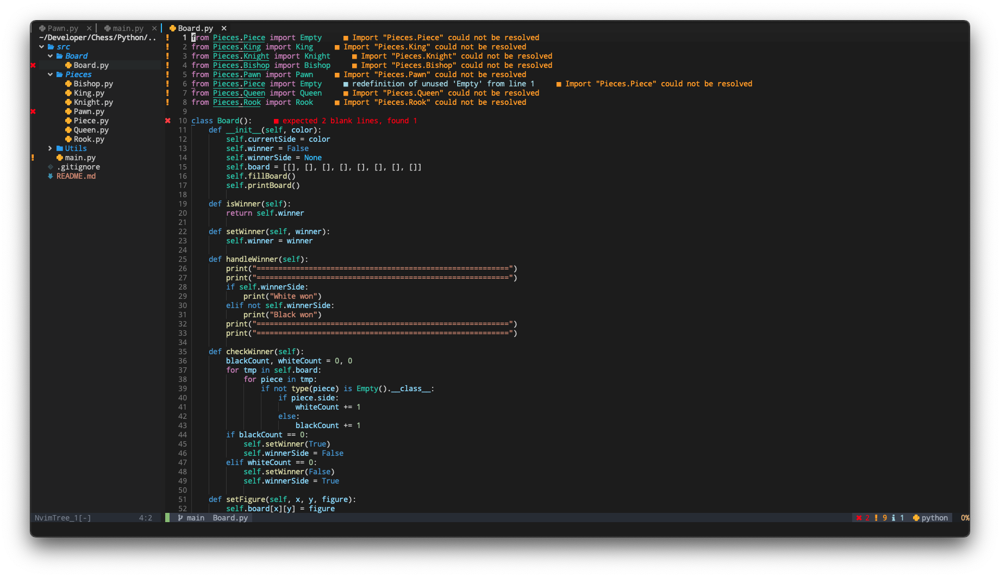

# Basic IDE Layer / Configuration for Neovim

This is my Personal `nvim` Configuration for daily usage that works completely fine on Linux and MacOS.

## Install Neovim

> Neovim 0.7

### Package Manager

You can install `nvim` using a package manager, but keep in mind that `nvim` may be updated to a newer version when you update packages. This can lead to a plugin suddenly not working anymore.

### Source

If you want to make sure `nvim` is only updated when you want, then I recommend installing from source.

```bash
$ git clone https://github.com/neovim/neovim.git
$ cd neovim
$ git checkout release-0.7
$ make CMAKE_BUILD_TYPE=RelWithDebInfo
$ sudo make install
```

## Install Configuration

Be sure to delete or move your current `nvim` directory. Run `nvim` and install all the plugins with:

```
:PackerInstall
```

In addition, the following command can be used to run a series of diagnostic tests to check the state of the Neovim installation. If it detects any problems, it usually offers suggestions on how to fix them or where to find out more

```
:checkhealth
```

## Font

- [Nerd Fonts](https://www.nerdfonts.com)

## Plugins

Managed by [wbthomason/packer.nvim](https://github.com/wbthomason/packer.nvim)

### Basic Plugins

- [mbbill/undotree](https://github.com/mbbill/undotree)
- [lewis6991/impatient.nvim](https://github.com/lewis6991/impatient.nvim)
- [terrortylor/nvim-comment](https://github.com/terrortylor/nvim-comment)
- [nvim-telescope/telescope.nvim](https://github.com/nvim-telescope/telescope.nvim)
- [lukas-reineke/indent-blankline.nvim](https://github.com/lukas-reineke/indent-blankline.nvim)
- [windwp/nvim-autopairs](https://github.com/windwp/nvim-autopairs)

### UI

- [akinsho/toggleterm.nvim](https://github.com/akinsho/toggleterm.nvim)
- [folke/which-key.nvim](https://github.com/folke/which-key.nvim)
- [romgrk/barbar.nvim](https://github.com/romgrk/barbar.nvim)
- [kyazdani42/nvim-tree.lua](https://github.com/kyazdani42/nvim-tree.lua)
- [lewis6991/gitsigns.nvim](https://github.com/lewis6991/gitsigns.nvim)
- [goolord/alpha-nvim](https://github.com/goolord/alpha-nvim)
- [SmiteshP/nvim-gps](https://github.com/SmiteshP/nvim-gps)
- [nvim-lualine/lualine.nvim](https://github.com/nvim-lualine/lualine.nvim)
- [nacro90/numb.nvim](https://github.com/nacro90/numb.nvim)
- [rcarriga/nvim-notify](https://github.com/rcarriga/nvim-notify)

### LSP

- [onsails/lspkind.nvim](https://github.com/onsails/lspkind.nvim)
- [neovim/nvim-lspconfig](https://github.com/neovim/nvim-lspconfig)
- [jose-elias-alvarez/null-ls.nvim](https://github.com/jose-elias-alvarez/null-ls.nvim)
- [RRethy/vim-illuminate](https://github.com/RRethy/vim-illuminate)
- [tamago324/nlsp-settings.nvim](https://github.com/tamago324/nlsp-settings.nvim)

### Auto Completion

- [hrsh7th/nvim-cmp](https://github.com/hrsh7th/nvim-cmp)
- [hrsh7th/cmp-buffer](https://github.com/hrsh7th/cmp-buffer)
- [hrsh7th/cmp-path](https://github.com/hrsh7th/cmp-path)
- [hrsh7th/cmp-cmdline](https://github.com/hrsh7th/cmp-cmdline)
- [github/copilot.vim](https://github.com/github/copilot.vim)
- [tpope/vim-sensible](https://github.com/tpope/vim-sensible)
- [tzachar/cmp-tabnine](https://github.com/tzachar/cmp-tabnine)
- [hrsh7th/cmp-nvim-lsp](https://github.com/hrsh7th/cmp-nvim-lsp)
- [saadparwaiz1/cmp_luasnip](https://github.com/saadparwaiz1/cmp_luasnip)

### Colorscheme

- [christianchiarulli/nvcode-color-schemes.vim](https://github.com/christianchiarulli/nvcode-color-schemes.vim)
- [shaeinst/roshnivim-cs](https://github.com/shaeinst/roshnivim-cs)
- [Lunarvim/colorschemes](https://github.com/Lunarvim/colorschemes)

### Treesitter

- [nvim-treesitter/nvim-treesitter](https://github.com/nvim-treesitter/nvim-treesitter)

### Snippets

- [L3MON4D3/LuaSnip](https://github.com/L3MON4D3/LuaSnip)
- [rafamadriz/friendly-snippets](https://github.com/rafamadriz/friendly-snippets)

## Showcase






