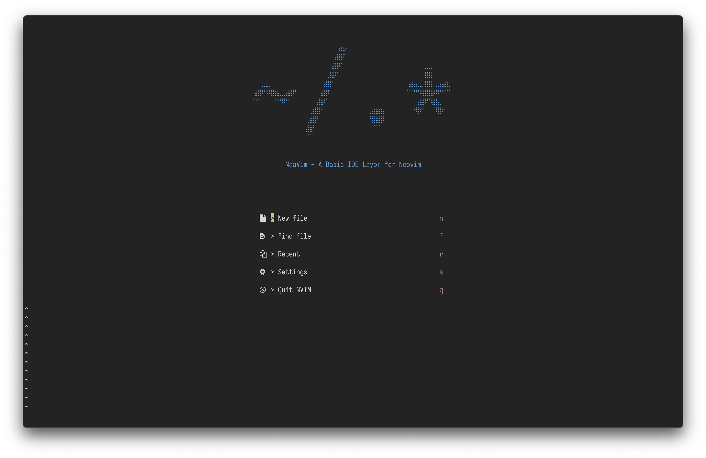
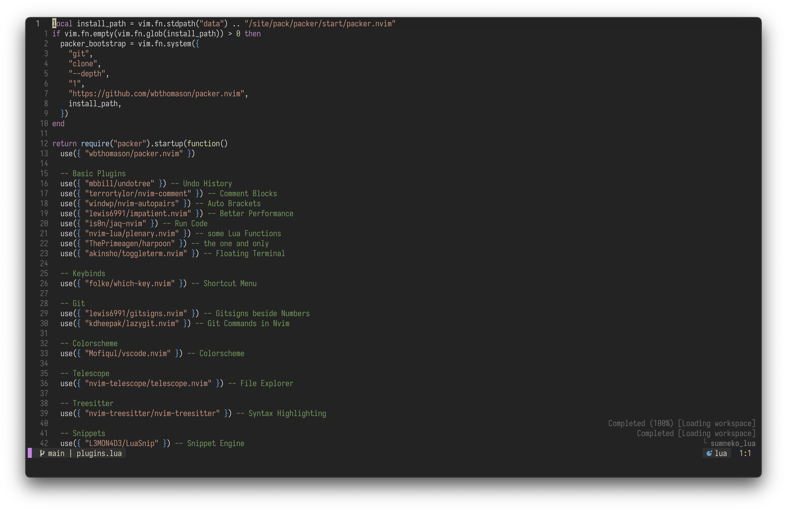
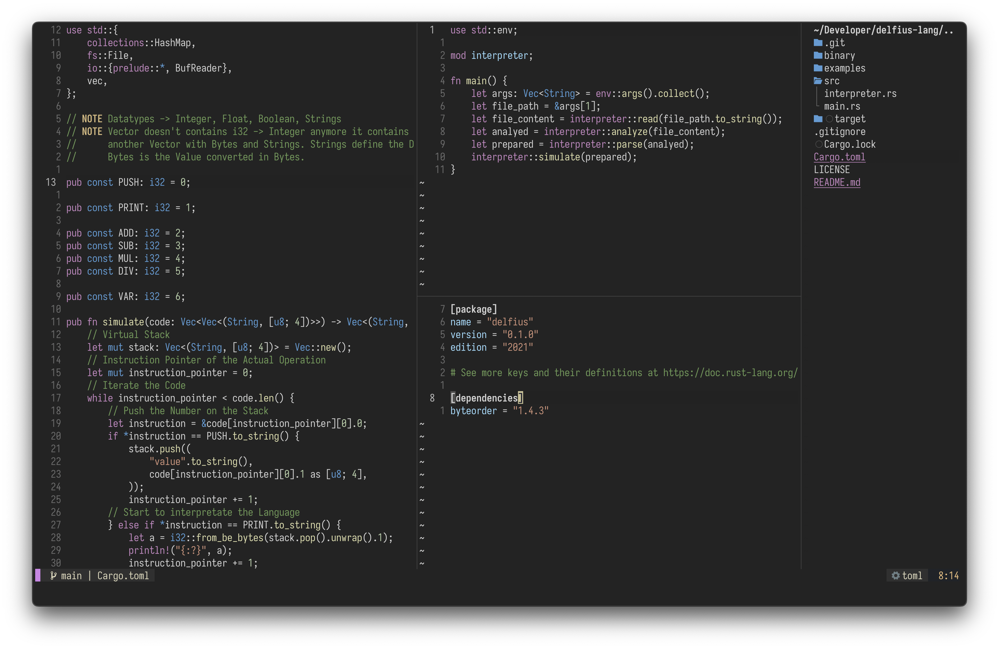
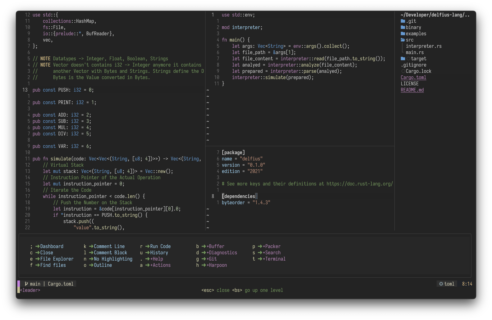
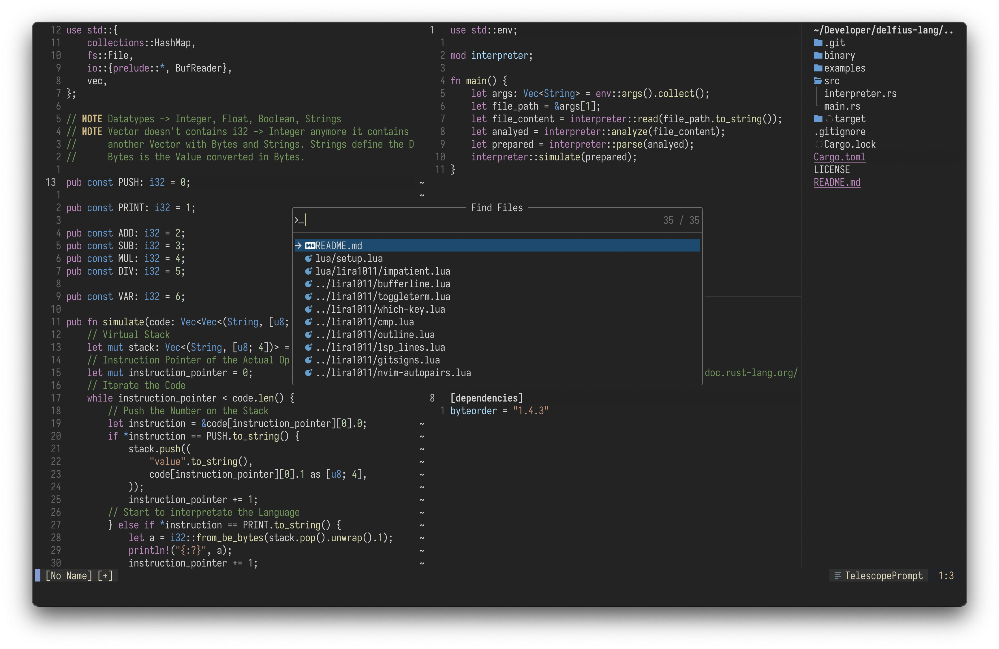
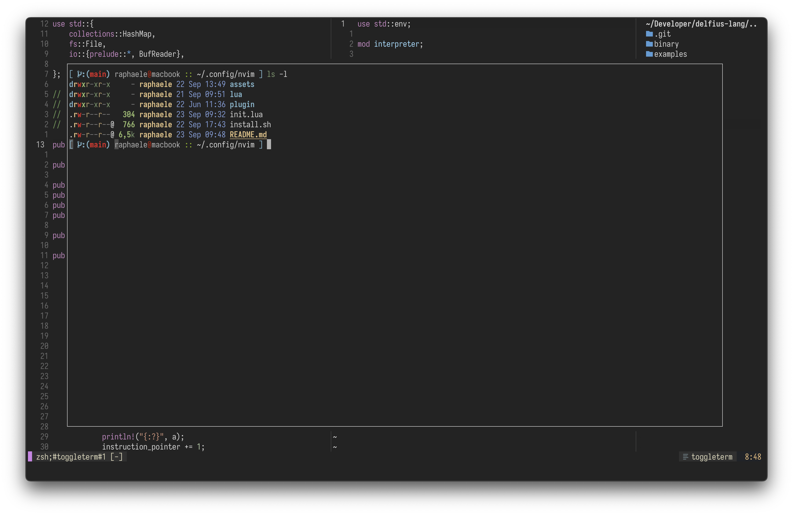

# NaVim

<b>Useable for </b>
macOS · Linux · (Windows)

> **NaVim** is my Personal `nvim` Configuration for daily usage that works completely fine on Linux and MacOS. **NaaVim** is a complete ide layer for `nvim` and easily customizable. it includes some useful plugins, but not everything the nvim community provides, for example no dap.

> Checkout the `beta` Branch for a Version twice as fast!

## Installation

> Neovim 0.8.1

### Package-Manager

You can install `nvim` using a package manager, but keep in mind that `nvim` may be updated to a newer version when you update packages. This can lead to a plugin suddenly not working anymore.

### Source

If you want to make sure `nvim` is only updated when you want, then I recommend installing from source.

```
$ git clone https://github.com/neovim/neovim.git
$ cd neovim
$ git checkout release-0.8.1
$ make CMAKE_BUILD_TYPE=RelWithDebInfo
$ sudo make install
```

## Configuration

Be sure to delete or move your current `nvim` directory. Run `nvim` and install all the plugins with:

```
:PackerInstall
```

In addition, the following command can be used to run a series of diagnostic tests to check the state of the Neovim installation. If it detects any problems, it usually offers suggestions on how to fix them or where to find out more

```
:checkhealth
```

### Install the Configuration in one Command

On Linux and MacOS the following command can be used to set the configuration (NaVim) directly. **Attention: Requirement is a suitable NeoVim installation!**

```
$ bash <(curl -s https://raw.githubusercontent.com/RaphaeleL/nvim/main/install.sh)
```

### Font

Use the [Nerd Fonts](https://www.nerdfonts.com) to get some fancy icons. Such **Nerd Fonts** are not mandatory, but are needed for the display of the icons.

> [Iosevka Nerd Fonts](https://github.com/ryanoasis/nerd-fonts/tree/master/patched-fonts/Iosevka)

```bash
$ curl -fLo "<FONT NAME> Nerd Font Complete.otf" \
    https://github.com/ryanoasis/nerd-fonts/raw/master/patched-fonts/<FONT_PATH>/complete/<FONT_NAME>%20Nerd%20Font%20Complete.otf
```

or for macOS Users via Homebrew:

```bash
$ brew tap homebrew/cask-fonts
$ brew install --cask font-<FONT NAME>-nerd-font
```

### Colorscheme

The colorscheme changes regularly and is mostly adjusted to subtle (therefore the colorscheme of the images from the showcase below is also not always 100% up to date). At the moment one from [catppuccin/nvim](https://github.com/catppuccin/nvim) is used.

### Structure

The File Strucutre explained.

```
- nvim
    - assets/           -- contains some demo images for the README.md
    - lua/              -- contains the configuration
        - user/         -- Wrapper, so you can name the Plugin Configuration Files can be named like the Plugin name
            - lsp/      -- Lsp Configuration
            - *.lua     -- Each Plugin has a Setup File (if needed)
        - *.lua         -- Basic NaVim Configuration (Neovim Settings, ...)
    - init.lua          -- the start of the nvim configuration
```

## Future

In the distant future `NaVim` shall have an independent instance or configuration besides the conventional `nvim`.

## Plugins

There are some popular plugins which are not listed here, for example Barber (Tab's). Mostly there are still configuration files for such plugins which have not been removed. It is better to have such files in the repository instead of having to rewrite the complex configuration.

> Plugins are managed by [wbthomason/packer.nvim](https://github.com/wbthomason/packer.nvim)

### Basic Plugins

- Undo History: [mbbill/undotree](https://github.com/mbbill/undotree)
- Comment Blocks: [terrortylor/nvim-comment](https://github.com/terrortylor/nvim-comment)
- Auto Brackets: [windwp/nvim-autopairs](https://github.com/windwp/nvim-autopairs)
- Better Performance: [lewis6991/impatient.nvim](https://github.com/lewis6991/impatient.nvim)
- some Lua Functions: [nvim-lua/plenary.nvim](https://github.com/nvim-lua/plenary.nvim)

### Keybinds

- Shortcut Menu: [folke/which-key.nvim](https://github.com/folke/which-key.nvim)

### Git

- Gitsigns beside Numbers: [lewis6991/gitsigns.nvim](https://github.com/lewis6991/gitsigns.nvim)
- Git Commands in Nvim: [kdheepak/lazygit.nvim](https://github.com/kdheepak/lazygit.nvim)

### Colorscheme

- Colorscheme: [catppuccin/nvim](https://github.com/catppuccin/nvim)

### Telescope

- File Explorer: [nvim-telescope/telescope.nvim](https://github.com/nvim-telescope/telescope.nvim)
- Action Select: [nvim-telescope/telescope-ui-select.nvim](https://github.com/nvim-telescope/telescope-ui-select.nvim)

### Treesitter

- Syntax Highlighting: [nvim-treesitter/nvim-treesitter](https://github.com/nvim-treesitter/nvim-treesitter)

### Snippets

- Snippet Engine: [L3MON4D3/LuaSnip](https://github.com/L3MON4D3/LuaSnip)
- Snippets: [rafamadriz/friendly-snippets](https://github.com/rafamadriz/friendly-snippets)
- Snippets: [saadparwaiz1/cmp_luasnip](https://github.com/saadparwaiz1/cmp_luasnip)

### UI

- Icons: [kyazdani42/nvim-web-devicons](https://github.com/kyazdani42/nvim-web-devicons)

### LSP

- Lsp Config: [neovim/nvim-lspconfig](https://github.com/neovim/nvim-lspconfig)
- Nvim Package Manager: [williamboman/mason.nvim](https://github.com/williamboman/mason.nvim)
- Mason Config: [williamboman/mason-lspconfig.nvim](https://github.com/williamboman/mason-lspconfig.nvim)
- Diagnostics / Code Actions: [jose-elias-alvarez/null-ls.nvim](https://github.com/jose-elias-alvarez/null-ls.nvim)

### Auto Completion

- Auto Completion Engine: [hrsh7th/nvim-cmp](https://github.com/hrsh7th/nvim-cmp)
- Auto Completion for Buffered words: [hrsh7th/cmp-buffer](https://github.com/hrsh7th/cmp-buffer)
- Auto Completion for Paths: [hrsh7th/cmp-path](https://github.com/hrsh7th/cmp-path)
- Auto Completion for Commands: [hrsh7th/cmp-cmdline](https://github.com/hrsh7th/cmp-cmdline)
- Auto Completion for Lsp Stuff: [hrsh7th/cmp-nvim-lsp](https://github.com/hrsh7th/cmp-nvim-lsp)

### Nice but not Needed

- Floating Terminal: [akinsho/toggleterm.nvim](https://github.com/akinsho/toggleterm.nvim)
- Global Search / Replace: [nvim-pack/nvim-spectre](https://github.com/nvim-pack/nvim-spectre)
- Run Code: [is0n/jaq-nvim](https://github.com/is0n/jaq-nvim)
- Lsp UI: [j-hui/fidget.nvim](https://github.com/j-hui/fidget.nvim)
- Dashboard: [goolord/alpha-nvim](https://github.com/goolord/alpha-nvim)
- File Explorer: [kyazdani42/nvim-tree.lua](https://github.com/kyazdani42/nvim-tree.lua)
- Indent Highlighting: [lukas-reineke/indent-blankline.nvim](https://github.com/lukas-reineke/indent-blankline.nvim)
- Highlight same Words: [RRethy/vim-illuminate](https://github.com/RRethy/vim-illuminate)

## Showcase

> Some small details are not up to date (like Lualine, Winbar/Navic and WhichKey), but there are not new Pictures after every new Plugin :D









# Performance 

Messured with the `time` Command for a 3000 Line Linux Kernel [File](https://raw.githubusercontent.com/torvalds/linux/master/kernel/auditsc.c):

> Yes, Vim is always faster than NeoVim with plugins will ever be. but compared to the popular LunarVim, NaVim Beta (without LazyLoading!) is almost twice as fast! NvChad is a lot faster than NaVim Beta is currently, but lazyloading is used there. With much larger files (then the 3000 Lines File mentioned), NaVim Beta will be faster.

- NaVim Main: `0,83s`
- NaVim Beta: `0,55s`
- LunarVim Stable: `0,94s`
- LunarVim Rolling: `0,96s`
- NvChad: `0,22s`
- Vim: `0,04s`

# Acknowledgments

This Configuration is inspired by:

- [NvChad](https://github.com/NvChad/NvChad)
- [LunarVim](https://github.com/LunarVim/LunarVim)
- [ThePrimeagen](https://github.com/ThePrimeagen)
- [TJ DeVries](https://github.com/tjdevries)
