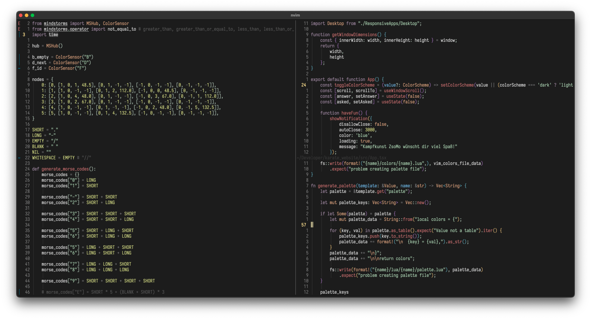
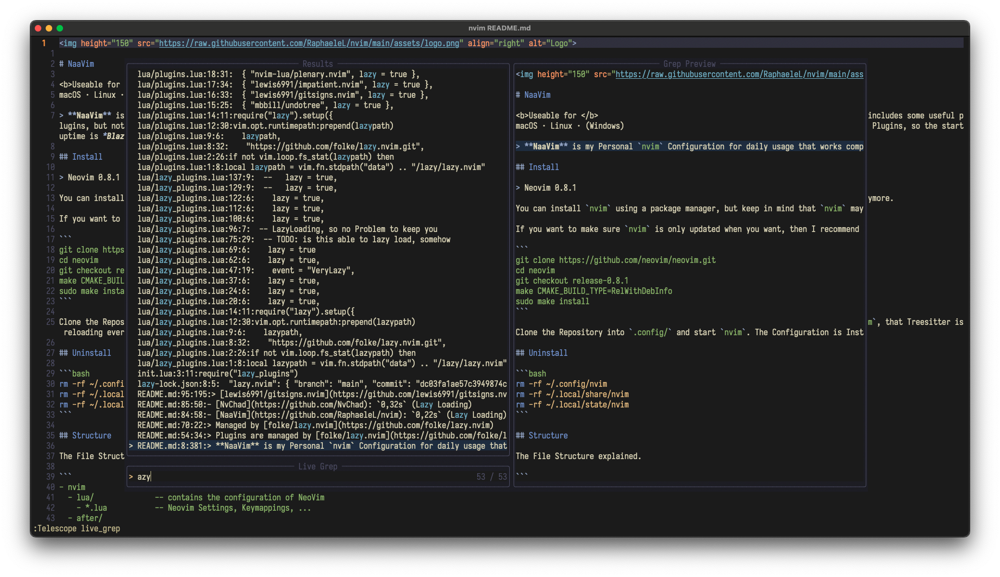

# NaaVim

<b>Useable for </b>
macOS · Linux · (Windows)

> **NaaVim** is my Personal `nvim` Configuration for daily usage that works completely fine on Linux and MacOS. **NaaVim** is a complete IDE layer for `nvim` and easily customizable. It includes some useful plugins, but not everything the `nvim` Community provides, for example no dap. Windows should somehow working, it's not tested, maybe with some small changes. Uhh and it's LazyLoading the Plugins, so the startuptime is *Blazyingly Fast*.

## Install

> Neovim 0.9.1

You can install `nvim` using a package manager, but keep in mind that `nvim` may be updated to a newer version when you update packages. This can lead to a plugin suddenly not working anymore.

If you want to make sure `nvim` is only updated when you want, then I recommend installing it from source this way:

```bash
git clone https://github.com/neovim/neovim.git
cd neovim
git checkout v0.9.1
make CMAKE_BUILD_TYPE=RelWithDebInfo
sudo make install
```

Clone the Repository into `.config/` and start `nvim`. The Configuration is Installing every Plugin, Language Server and Syntax Highlighting automatically.

```bash 
cd ~/.config
git clone https://github.com/RaphaeleL/nvim
```

The configuration file `vi.lua` is a separate `nvim` configuration file intended to replace `vi`/`vim` with a `nvim`-based configuration. This is necessary because there are compatibility issues with different types of terminals. Every `nvim` configuration is not available on the MacOS terminal, so `vi.lua` is a convenient replacement for small changes. Use this Command to start it.

```bash
NVIM_APPNAME=macnvim nvim
```

## Uninstall 

```bash 
rm -rf ~/.config/nvim
rm -rf ~/.local/share/nvim
rm -rf ~/.local/state/nvim
```

## Structure

The File Structure explained.

```
~/.config/nvim/                       # Base Folder
~/.config/nvim/init.lua               # the start of every Configuration
~/.config/nvim/lua/                   # Contains the configuration of NeoVim
~/.config/nvim/lua/*.lua              # Neovim Settings, Keymappings, ... 
~/.config/nvim/lua/plugins/*.lua      # List of the Plugins, sorted by Type 
~/.config/nvim/after/ftplugin/*       # File Specific Settings 
~/.config/nvim/ftplugin/*             # Language Specific Settings 
```

The Structure of `macnvim/` explained.

```
~/.config/macnvim/                    # Base Folder
~/.config/macnvim/init.lua            # the start of every Configuration
~/.config/macnvim/lua/                # Contains the configuration of NeoVim
```

## Plugins

Plugins are managed by [folke/lazy.nvim](https://github.com/folke/lazy.nvim)

> Remove plugins that you have used less than 5 times in the last 3-4 weeks.

### Basic Plugins

- Better Performance: [lewis6991/impatient.nvim](https://github.com/lewis6991/impatient.nvim)
- Some Lua Functions: [nvim-lua/plenary.nvim](https://github.com/nvim-lua/plenary.nvim)
- Git Changes: [lewis6991/gitsigns.nvim](https://github.com/lewis6991/gitsigns.nvim)
- Fuzzy File Explorer: [nvim-telescope/telescope.nvim](https://github.com/nvim-telescope/telescope.nvim)
- Syntax Highlighting: [nvim-treesitter/nvim-treesitter](https://github.com/nvim-treesitter/nvim-treesitter)

### Language Server Protocol

> The Language Server Protocol turns a text editor into an IDE with autocompletion.

- Lsp Configuration: [neovim/nvim-lspconfig](https://github.com/neovim/nvim-lspconfig)
- Lsp Package Manager: [williamboman/mason.nvim](https://github.com/williamboman/mason.nvim)
- Lsp Package Manager Configuration: [williamboman/mason-lspconfig.nvim](https://github.com/williamboman/mason-lspconfig.nvim)
- Auto Completion Enginge: [hrsh7th/nvim-cmp](https://github.com/hrsh7th/nvim-cmp)
- Auto Completion for LSP: [hrsh7th/cmp-nvim-lsp](https://github.com/hrsh7th/cmp-nvim-lsp)
- Auto Completion for Lua Snip: [saadparwaiz1/cmp_luasnip](https://github.com/saadparwaiz1/cmp_luasnip)
- Snippet Engine: [L3MON4D3/LuaSnip](https://github.com/L3MON4D3/LuaSnip)
- Signature Help: [folke/neodev.nvim](https://github.com/folke/neodev.nvim)

### More Basic Plugins

> The following plugins are really cool, useful and great. But they are not necessary. Thanks to Lazy Loading there are no performance disadvantages and can be keeped without any problems.

- Show Indentlines: [lukas-reineke/indent-blankline.nvim](https://github.com/lukas-reineke/indent-blankline.nvim)
- Notifications: [rcarriga/nvim-notify](https://github.com/rcarriga/nvim-notify)
- Comments: [terrortylor/nvim-comment](https://github.com/terrortylor/nvim-comment)
- Auto Close the Brackets: [windwp/nvim-autopairs](https://github.com/windwp/nvim-autopairs)
- Coloring the `f` - Movement: [jinh0/eyeliner.nvim](https://github.com/jinh0/eyeliner.nvim)
- Configurable Bar in the Top: [SmiteshP/nvim-navic](https://github.com/SmiteshP/nvim-navic)
- LSP Context in the Top: [utilyre/barbecue.nvim](https://github.com/utilyre/barbecue.nvim)
- Mark Files: [ThePrimeagen/harpoon](https://github.com/ThePrimeagen/harpoon)
- Git Client: [kdheepak/lazygit.nvim](https://github.com/kdheepak/lazygit.nvim)
- Which Key: [folke/which-key.nvim](https://github.com/folke/which-key.nvim)
- Spectre: [nvim-pack/nvim-spectre](https://github.com/nvim-pack/nvim-spectre)
- Trouble: [folke/trouble.nvim](https://github.com/folke/trouble.nvim)
- Terminal: [akinsho/toggleterm.nvim](https://github.com/akinsho/toggleterm.nvim)

# Acknowledgments

This Configuration is inspired by:

- [NvChad](https://github.com/NvChad)
- [LunarVim](https://github.com/LunarVim)
- [ThePrimeagen](https://github.com/ThePrimeagen)
- [TJ DeVries](https://github.com/tjdevries)

## Showcase



