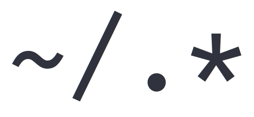

 

# NaaVim

<b>Useable for </b>
macOS · Linux · (Windows)

> **NaaVim** is my Personal `nvim` Configuration for daily usage that works completely fine on Linux and MacOS. **NaaVim** is a complete ide layer for `nvim` and easily customizable. it includes some useful plugins, but not everything the nvim community provides, for example no dap.

## Installation

> Neovim 0.7.2

### Package-Manager

You can install `nvim` using a package manager, but keep in mind that `nvim` may be updated to a newer version when you update packages. This can lead to a plugin suddenly not working anymore.

### Source

If you want to make sure `nvim` is only updated when you want, then I recommend installing from source.

```
$ git clone https://github.com/neovim/neovim.git
$ cd neovim
$ git checkout release-0.7
$ make CMAKE_BUILD_TYPE=RelWithDebInfo
$ sudo make install
```

## Configuration

Be sure to delete or move your current `nvim` directory. Run `nvim` and install all the plugins with:

```
:PackerInstall
```

In addition, the following command can be used to run a series of diagnostic tests to check the state of the Neovim installation. If it detects any problems, it usually offers suggestions on how to fix them or where to find out more

```
:checkhealth
```

### Install the Configuration in one Command

On Linux and MacOS the following command can be used to set the configuration (NaaVim) directly. **Attention: Requirement is a suitable NeoVim installation!**

```
$ bash <(curl -s https://raw.githubusercontent.com/RaphaeleL/nvim/main/install.sh)
```

### Font

Use the [Nerd Fonts](https://www.nerdfonts.com) to get some fancy icons. Such **Nerd Fonts** are not mandatory, but are needed for the display of the icons.

> [Iosevka Nerd Fonts](https://github.com/ryanoasis/nerd-fonts/tree/master/patched-fonts/Iosevka)

```bash
$ curl -fLo "<FONT NAME> Nerd Font Complete.otf" \
    https://github.com/ryanoasis/nerd-fonts/raw/master/patched-fonts/<FONT_PATH>/complete/<FONT_NAME>%20Nerd%20Font%20Complete.otf
```

or for macOS Users via Homebrew:

```bash
$ brew tap homebrew/cask-fonts
$ brew install --cask font-<FONT NAME>-nerd-font
```

### Colorscheme

The colorscheme changes regularly and is mostly adjusted to subtle (therefore the colorscheme of the images from the showcase below is also not always 100% up to date). At the moment one from [Mofiqul/vscode](https://github.com/Mofiqul/vscode.nvim) is used.

### Structure

The File Strucutre explained.

```
- nvim
    - assets/           -- contains some demo images for the README.md
    - lua/              -- contains the configuration
        - user/         -- Wrapper, so you can name the Plugin Configuration Files can be named like the Plugin name
            - lsp/      -- Lsp Configuration
            - *.lua     -- Each has a Setup File if needed
        - *.lua         -- Basic NaaVim Configuration (Neovim Settings, ...)
    - init.lua          -- the start of the nvim configuration
```

## Plugins

There are some popular plugins which are not listed here, for example Barber (Tab's). Mostly there are still configuration files for such plugins which have not been removed. It is better to have such files in the repository instead of having to rewrite the complex configuration.

> Plugins are managed by [wbthomason/packer.nvim](https://github.com/wbthomason/packer.nvim)

### Basic Plugins

- Undo History: [mbbill/undotree](https://github.com/mbbill/undotree)
- Comment Blocks: [terrortylor/nvim-comment](https://github.com/terrortylor/nvim-comment)
- Auto Brackets: [windwp/nvim-autopairs](https://github.com/windwp/nvim-autopairs)
- Better Performance: [lewis6991/impatient.nvim](https://github.com/lewis6991/impatient.nvim)
- Run Code: [is0n/jaq-nvim](https://github.com/is0n/jaq-nvim)
- Some Lua Functions: [nvim-lua/plenary.nvim](https://github.com/nvim-lua/plenary.nvim)

### Git

- Git Signs: [lewis6991/gitsigns.nvim](https://github.com/lewis6991/gitsigns.nvim)

### Colorscheme

- Colorscheme: [rebelot/kanagawa.nvim](https://github.com/rebelot/kanagawa.nvim)

### Telescope

- File Explorer: [nvim-telescope/telescope.nvim](https://github.com/nvim-telescope/telescope.nvim)

### Treesitter

- Syntax Highlighting: [nvim-treesitter/nvim-treesitter](https://github.com/nvim-treesitter/nvim-treesitter)
- Sticky Methods: [nvim-treesitter/nvim-treesitter-context](https://github.com/nvim-treesitter/nvim-treesitter-context)

### Snippets

- Snippet Engine: [L3MON4D3/LuaSnip](https://github.com/L3MON4D3/LuaSnip)
- Snippets: [rafamadriz/friendly-snippets](https://github.com/rafamadriz/friendly-snippets)

### UI

- Icons: [kyazdani42/nvim-web-devicons](https://github.com/kyazdani42/nvim-web-devicons)
- Indent Highlighting: [lukas-reineke/indent-blankline.nvim](https://github.com/lukas-reineke/indent-blankline.nvim)
- Tab Bar: [romgrk/barbar.nvim](https://github.com/romgrk/barbar.nvim)
- File Explorer: [kyazdani42/nvim-tree.lua](https://github.com/kyazdani42/nvim-tree.lua)
- Menu Bar: [nvim-lualine/lualine.nvim](https://github.com/nvim-lualine/lualine.nvim)
- Notifications: [rcarriga/nvim-notify](https://github.com/rcarriga/nvim-notify)
- Dashboard: [goolord/alpha-nvim](https://github.com/goolord/alpha-nvim)
- Highlight same words: [RRethy/vim-illuminate](https://github.com/RRethy/vim-illuminate)

### LSP

- Lsp Installer: [williamboman/nvim-lsp-installer](https://github.com/williamboman/nvim-lsp-installer)
- Lsp Config: [neovim/nvim-lspconfig](https://github.com/neovim/nvim-lspconfig)
- Diagnostics / Code Actions: [jose-elias-alvarez/null-ls.nvim](https://github.com/jose-elias-alvarez/null-ls.nvim)
- Lsp Config with Json: [tamago324/nlsp-settings.nvim](https://github.com/tamago324/nlsp-settings.nvim)

### Auto Completion

- Auto Completion Engine: [hrsh7th/nvim-cmp](https://github.com/hrsh7th/nvim-cmp)
- Auto Completion for Buffered words: [hrsh7th/cmp-buffer](https://github.com/hrsh7th/cmp-buffer)
- Auto Completion for Paths: [hrsh7th/cmp-path](https://github.com/hrsh7th/cmp-path)
- Auto Completion for Commands: [hrsh7th/cmp-cmdline](https://github.com/hrsh7th/cmp-cmdline)
- Auto Completion for Lsp Stuff: [hrsh7th/cmp-nvim-lsp](https://github.com/hrsh7th/cmp-nvim-lsp)
- AI Completion: [tzachar/cmp-tabnine](https://github.com/tzachar/cmp-tabnine)

## Showcase


