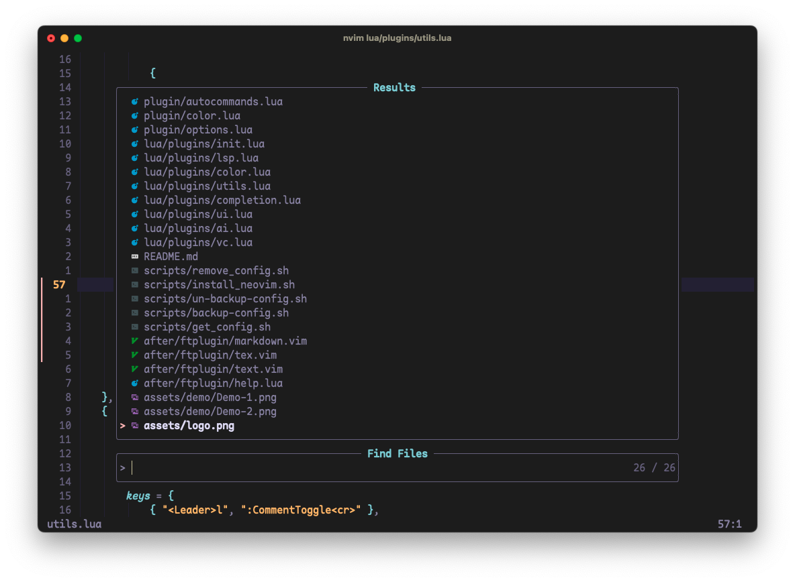
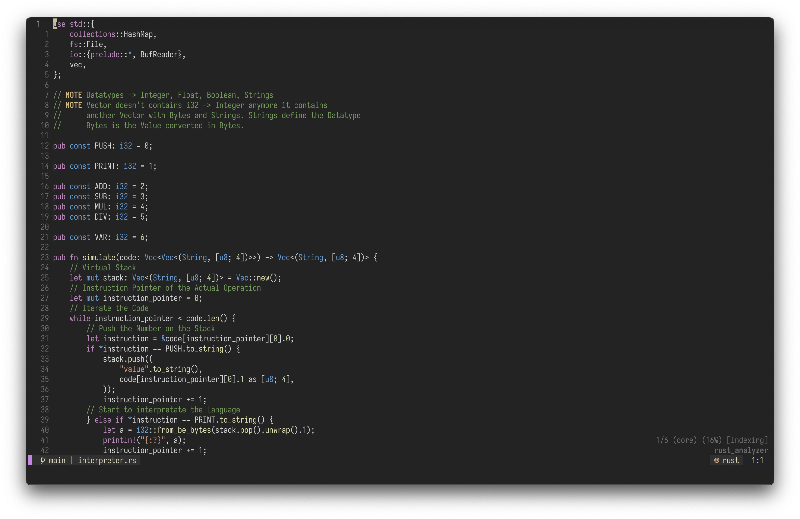

# Basic IDE Layer (Configuration) for Neovim

**NaaVim** is my Personal `nvim` Configuration for daily usage that works completely fine on Linux and MacOS. **NaaVim** is a complete ide layer for `nvim` and easily customizable. it includes some useful plugins, but not everything the nvim community provides, for example no dap.

## Table of Contents

1. [Installation](#installation)
   - [Package Manager](#package-manager)
   - [Source](#source)
2. [Configuration](#configuration)
   - [Font](#font)
   - [Strucutre](#strucutre)
3. [Plugins](#plugins)
   - [Basic-Plugins](#basic-plugins)
   - [UI](#ui)
   - [Lsp](#lsp)
   - [Auto Completion](#auto-completion)
   - [Colorscheme](#colorscheme)
   - [Treesitter](#treesitter)
   - [Snippets](#snippets)
4. [Showcase](#showcase)

## Installation

> Neovim 0.7

### Package-Manager

You can install `nvim` using a package manager, but keep in mind that `nvim` may be updated to a newer version when you update packages. This can lead to a plugin suddenly not working anymore.

### Source

If you want to make sure `nvim` is only updated when you want, then I recommend installing from source.

```
$ git clone https://github.com/neovim/neovim.git
$ cd neovim
$ git checkout release-0.7
$ make CMAKE_BUILD_TYPE=RelWithDebInfo
$ sudo make install
```

## Configuration

Be sure to delete or move your current `nvim` directory. Run `nvim` and install all the plugins with:

```
:PackerInstall
```

In addition, the following command can be used to run a series of diagnostic tests to check the state of the Neovim installation. If it detects any problems, it usually offers suggestions on how to fix them or where to find out more

```
:checkhealth
```

### Font

Use the [Nerd Fonts](https://www.nerdfonts.com) to get some fancy icons.

> [Iosevka Nerd Fonts](https://github.com/ryanoasis/nerd-fonts/tree/master/patched-fonts/Iosevka)

### Structure

The File Strucutre explained.

```
- nvim
    - assets/           -- contains some demo images for the README.md
    - lua/              -- contains the configuration
        - user/         -- Wrapper, so you can name the Plugin Configuration Files can be named like the Plugin name
            - lsp/      -- Lsp Configuration
            - *.lua     -- Each has a Setup File if needed
        - *.lua         -- Basic NaaVim Configuration (Neovim Settings, ...)
    - init.lua          -- the start of the nvim configuration
```

## Plugins

there may well be some configurations files that are not called. for example neotree. i think it is better to have them rather than having to rewrite them.

> Plugins are managed by [wbthomason/packer.nvim](https://github.com/wbthomason/packer.nvim)

### Basic Plugins

- [mbbill/undotree](https://github.com/mbbill/undotree)
- [lewis6991/impatient.nvim](https://github.com/lewis6991/impatient.nvim)
- [terrortylor/nvim-comment](https://github.com/terrortylor/nvim-comment)
- [nvim-telescope/telescope.nvim](https://github.com/nvim-telescope/telescope.nvim)
- [lukas-reineke/indent-blankline.nvim](https://github.com/lukas-reineke/indent-blankline.nvim)
- [windwp/nvim-autopairs](https://github.com/windwp/nvim-autopairs)
- [kyazdani42/nvim-web-devicons](https://github.com/kyazdani42/nvim-web-devicons)
- [nvim-lua/plenary.nvim](https://github.com/nvim-lua/plenary.nvim)

### UI

- [akinsho/toggleterm.nvim](https://github.com/akinsho/toggleterm.nvim)
- [folke/which-key.nvim](https://github.com/folke/which-key.nvim)
- [romgrk/barbar.nvim](https://github.com/romgrk/barbar.nvim)
- [kyazdani42/nvim-tree.lua](https://github.com/kyazdani42/nvim-tree.lua)
- [goolord/alpha-nvim](https://github.com/goolord/alpha-nvim)
- [SmiteshP/nvim-gps](https://github.com/SmiteshP/nvim-gps)
- [nvim-lualine/lualine.nvim](https://github.com/nvim-lualine/lualine.nvim)
- [nacro90/numb.nvim](https://github.com/nacro90/numb.nvim)
- [rcarriga/nvim-notify](https://github.com/rcarriga/nvim-notify)
- [simrat39/symbols-outline.nvim](https://github.com/simrat39/symbols-outline.nvim)

### Git

- [lewis6991/gitsigns.nvim](https://github.com/lewis6991/gitsigns.nvim)
- [f-person/git-blame.nvim](https://github.com/f-person/git-blame.nvim)

### LSP

- [onsails/lspkind.nvim](https://github.com/onsails/lspkind.nvim)
- [neovim/nvim-lspconfig](https://github.com/neovim/nvim-lspconfig")
- [jose-elias-alvarez/null-ls.nvim](https://github.com/jose-elias-alvarez/null-ls.nvim)
- [RRethy/vim-illuminate](https://github.com/RRethy/vim-illuminate)
- [tamago324/nlsp-settings.nvim](https://github.com/tamago324/nlsp-settings.nvim)
- [ray-x/lsp_signature.nvim](https://github.com/ray-x/lsp_signature.nvim)

### Auto Completion

- [hrsh7th/nvim-cmp](https://github.com/hrsh7th/nvim-cmp)
- [hrsh7th/cmp-buffer](https://github.com/hrsh7th/cmp-buffer)
- [hrsh7th/cmp-path](https://github.com/hrsh7th/cmp-path)
- [hrsh7th/cmp-cmdline](https://github.com/hrsh7th/cmp-cmdline)
- [tpope/vim-sensible](https://github.com/tpope/vim-sensible)
- [tzachar/cmp-tabnine])(https://github.com/tzachar/cmp-tabnine")
- [hrsh7th/cmp-nvim-lsp](https://github.com/hrsh7th/cmp-nvim-lsp)
- [saadparwaiz1/cmp_luasnip](https://github.com/saadparwaiz1/cmp_luasnip)

### Colorscheme

- [olimorris/onedarkpro.nvim](https://github.com/olimorris/onedarkpro.nvim)
- [christianchiarulli/nvcode-color-schemes.vim](https://github.com/christianchiarulli/nvcode-color-schemes.vim)
- [shaeinst/roshnivim-cs](https://github.com/shaeinst/roshnivim-cs)
- [Lunarvim/colorschemes](https://github.com/Lunarvim/colorschemes)
- [lunarvim/darkplus.nvim](https://github.com/lunarvim/darkplus.nvim)
- [tiagovla/tokyodark.nvim](https://github.com/tiagovla/tokyodark.nvim)
- [B4mbus/oxocarbon-lua.nvim](https://github.com/B4mbus/oxocarbon-lua.nvim)

### Treesitter

- [nvim-treesitter/nvim-treesitter](https://github.com/nvim-treesitter/nvim-treesitter)
- [p00f/nvim-ts-rainbow](https://github.com/p00f/nvim-ts-rainbow)

### Snippets

- [L3MON4D3/LuaSnip](https://github.com/L3MON4D3/LuaSnip)
- [rafamadriz/friendly-snippets](https://github.com/rafamadriz/friendly-snippets)

### Quickrun

- [is0n/jaq-nvim](https://github.com/is0n/jaq-nvim)

## Showcase

> Demo Pictures will be updated if Neovim 0.8 is released





