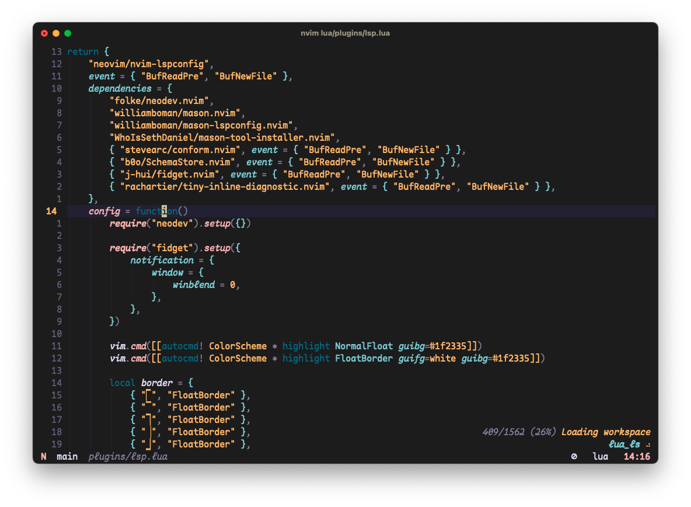
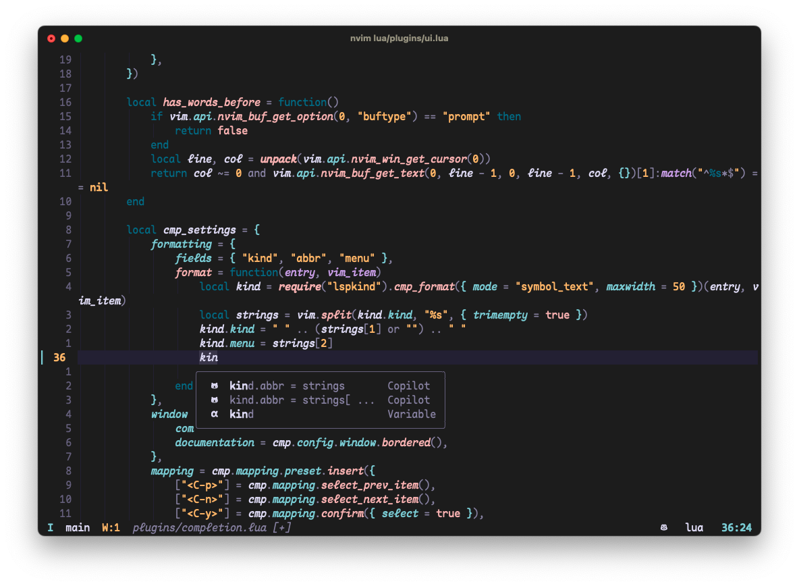

# NaaVim

<b>Useable for </b>
macOS · Linux · (Windows)

> **NaaVim** is my Personal `nvim` Configuration for daily usage that works completely fine on Linux and MacOS. **NaaVim** is a complete IDE layer for `nvim` and easily customizable. It includes some useful plugins, but not everything the `nvim` Community provides, for example no dap. Windows should somehow working, it's not tested, maybe with some small changes. Uhh and it's LazyLoading the Plugins, so the startuptime is *Blazyingly Fast*.

## Install

> Neovim 0.8.3

You can install `nvim` using a package manager, but keep in mind that `nvim` may be updated to a newer version when you update packages. This can lead to a plugin suddenly not working anymore.

If you want to make sure `nvim` is only updated when you want, then I recommend installing it from source this way:

```bash
git clone https://github.com/neovim/neovim.git
cd neovim
git checkout v0.8.3
make CMAKE_BUILD_TYPE=RelWithDebInfo
sudo make install
```

Clone the Repository into `.config/` and start `nvim`. The Configuration is Installing every Plugin, Language Server and Syntax Highlighting automatically.

```bash 
cd ~/.config
git clone https://github.com/RaphaeleL/nvim
```

The configuration file `vi.lua` is a separate `nvim` configuration file intended to replace `vi`/`vim` with a `nvim`-based configuration. This is necessary because there are compatibility issues with different types of terminals. Every `nvim` configuration is not available on the MacOS terminal, so `vi.lua` is a convenient replacement for small changes. Use this Command to start it.

```bash
NVIM_APPNAME=macnvim nvim
```

## Uninstall 

```bash 
rm -rf ~/.config/nvim
rm -rf ~/.local/share/nvim
rm -rf ~/.local/state/nvim
```

## Structure

The File Structure explained.

```
~/.config/nvim/                       # Base Folder
~/.config/nvim/init.lua               # the start of every Configuration
~/.config/nvim/lua/                   # Contains the configuration of NeoVim
~/.config/nvim/lua/*.lua              # Neovim Settings, Keymappings, ... 
~/.config/nvim/lua/plugins/*.lua      # List of the Plugins, sorted by Type 
~/.config/nvim/after/ftplugin/*       # File Specific Settings 
~/.config/nvim/ftplugin/*             # Language Specific Settings 
```

The File Structure of `vi.lua` explained.

```
~/.config/macnvim/                    # Base Folder
~/.config/macnvim/vi.lua              # the start of every Configuration
```

## Plugins

Plugins are managed by [folke/lazy.nvim](https://github.com/folke/lazy.nvim)

> Remove plugins that you have used less than 5 times in the last 3-4 weeks.

### Basic Plugins

- Better Performance: [lewis6991/impatient.nvim](https://github.com/lewis6991/impatient.nvim)
- Some Lua Functions: [nvim-lua/plenary.nvim](https://github.com/nvim-lua/plenary.nvim)
- Git Changes: [lewis6991/gitsigns.nvim](https://github.com/lewis6991/gitsigns.nvim)
- Fuzzy File Explorer: [nvim-telescope/telescope.nvim](https://github.com/nvim-telescope/telescope.nvim)
- Syntax Highlighting: [nvim-treesitter/nvim-treesitter](https://github.com/nvim-treesitter/nvim-treesitter)

### Language Server Protocol

> The Language Server Protocol turns a text editor into an IDE with autocompletion.

- Lsp Configuration: [neovim/nvim-lspconfig](https://github.com/neovim/nvim-lspconfig)
- Lsp Package Manager: [williamboman/mason.nvim](https://github.com/williamboman/mason.nvim)
- Lsp Package Manager Configuration: [williamboman/mason-lspconfig.nvim](https://github.com/williamboman/mason-lspconfig.nvim)
- Auto Completion Enginge: [hrsh7th/nvim-cmp](https://github.com/hrsh7th/nvim-cmp)
- Auto Completion for LSP: [hrsh7th/cmp-nvim-lsp](https://github.com/hrsh7th/cmp-nvim-lsp)
- Auto Completion for Lua Snip: [saadparwaiz1/cmp_luasnip](https://github.com/saadparwaiz1/cmp_luasnip)
- Snippet Engine: [L3MON4D3/LuaSnip](https://github.com/L3MON4D3/LuaSnip)
- Signature Help: [folke/neodev.nvim](https://github.com/folke/neodev.nvim)
- Lsp Status Information: [j-hui/fidget.nvim](https://github.com/j-hui/fidget.nvim)

### A.I.

- Copilot: [zbirenbaum/copilot.lua](https://github.com/zbirenbaum/copilot.lua)
- Cmp for Copilot: [zbirenbaum/copilot-cmp](https://github.com/zbirenbaum/copilot-cmp)

### Languages 

> for some languages an extension plugin is very useful!

- Java: [mfussenegger/nvim-jdtls](https://github.com/mfussenegger/nvim-jdtls)

### More Basic Plugins

> The following plugins are really cool, useful and great. But they are not necessary. Thanks to Lazy Loading there are no performance disadvantages and can be keeped without any problems.

- Show Indentlines: [lukas-reineke/indent-blankline.nvim](https://github.com/lukas-reineke/indent-blankline.nvim)
- Notifications: [rcarriga/nvim-notify](https://github.com/rcarriga/nvim-notify)
- Comments: [terrortylor/nvim-comment](https://github.com/terrortylor/nvim-comment)
- Auto Close the Brackets: [windwp/nvim-autopairs](https://github.com/windwp/nvim-autopairs)
- Coloring the `f` - Movement: [jinh0/eyeliner.nvim](https://github.com/jinh0/eyeliner.nvim)
- Configurable Bar in the Top: [SmiteshP/nvim-navic](https://github.com/SmiteshP/nvim-navic)
- LSP Context in the Top: [utilyre/barbecue.nvim](https://github.com/utilyre/barbecue.nvim)
- Mark Files: [ThePrimeagen/harpoon](https://github.com/ThePrimeagen/harpoon)

### NaaVim Keymaps 

Short Overview of some NaaVim Keymaps. If you want an overview while Coding just type `<leader>` to open the Help.

> In this overview only NaaVim specific shortcuts are listed. (Neo-) Vim specific shortcuts are not included here! For this you will find a [Cheatsheet](https://github.com/RaphaeleL/Cheatsheet/blob/main/Vim.md) from me. 

- `<leader>sf`: Show Fuzzy File Finder
- `<leader>sl`: Show Live Grep
- `<leader>sg`: Show Git Files
- `<leader>sb`: Show Buffers
- `<leader>sd`: Show Diagnostics
- `<leader>ss`: Show Grep
- `<leader>so`: Show Outliner
- `<leader>sk`: Show Keymaps
- `<leader>?`: Show Oldfiles
- `<leader>/`: Search in the Current File
- `ca`: Code Action
- `sd`: Open Diagnostics
- `gr`: Goto Reference
- `gd`: Goto Definition
- `gn`: Goto Next Diagnostic
- `gp`: Goto Previous Diagnostic
- `K`: Hover Documentation
- `<leader>k`: Signature Documentation
- `ff`: Format File
- `kj`: Go to Normal Mode
- `jk`: Go to Normal Mode
- `<Space>`: Leader
- `<C-s>`: Force Write everything
- `<C-w>`: Force Write and Quit everything
- `<TAB>`: Next Tab and Write Buffer
- `<S-TAB>`: Previous Tab and Write Buffer
- `<C-h>`: Move to the left Window
- `<C-j>`: Move to the bottom Window
- `<C-k>`: Move to the upper Window
- `<C-l>`: Move to the right Window
- `sv`: Vertical Split
- `sh`: Horizontal Split
- `c`: Close Buffer
- `q`: Quit Buffer
- `<C-d>`: Move Page up and stay in the Middle of the Screen
- `<C-u>`: Move Page up and stay in the Middle of the Screen
- `<Leader>n`: No Highlighting
- `<leader>r`: Rename
- `<leader>x`: Add Execution Permission to the File
- `<leader>c`: Run: Run the Compilation Command
- `+`: Increment a Number
- `-`: Decrement a Number
- `<Leader>Y`: Yank line
- `<Leader>p`: Paste without losing the Buffer
- `x`: Delete Char without losing the Buffer
- `<`: Indent to Left
- `>`: Indent to Right
- `<Leader>l`: Comment Selection in/out
- `<leader>a`: mark everything
- `J`: Move Selection up
- `K`: Move Selection down
- `J`: Concat Line without moving the Cursor
- `<leader>S`: Search and Replace
- `<Leader>gd`: Git toggle deleted
- `<Leader>gn`: Git toggle Line Number Signs
- `<Leader>gs`: Git toggle Signs
- `m`: Open Mark Menu
- `ma`: Mark a File
- `mn`: Move to next File
- `mp`: Move to previous File
- `mc`: Clear all Marks
- `mr`: Remove Selected Mark

#### NvimTree Keymaps

- `<CR>`: Open 
- `<C-v>`: Open Vertical
- `<C-x>`: Open Horizontal 
- `<C-k>`: Open Information 
- `g?`: Toggle Help 
- `-`: Up 
- `R`: Refresh 
- `S`: Search 
- `gy`: Copy absolute Path 
- `r`: Rename
- `d`: Delete
- `x`: Cut 
- `c`: Copy 
- `p`: Paste 
- `a`: Create a File 

# Acknowledgments

This Configuration is inspired by:

- [NvChad](https://github.com/NvChad)
- [LunarVim](https://github.com/LunarVim)
- [ThePrimeagen](https://github.com/ThePrimeagen)
- [TJ DeVries](https://github.com/tjdevries)

## Showcase



